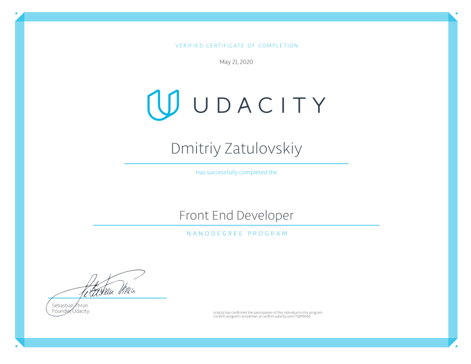

# Project Two - Landing Page (JavaScript).
Training project for [Udacity.com]. Certificate Nanodegree Program - [Front End Web Developer]



### Project structure

```html
├── /css/                 // folder for css files.
│     └── style.css      // file contain CSS styles used in the project.
├── /js/                  // folder for js files.   
│     └── app.js         // file contain JavaScript code used in the project.
├── /images/              // folder for favicon images.  
│     └── ...
├── .gitignore            // file to exclude files and folders from the repository.
├── package-lock.json     // npm configuration file.
├── package.json          // npm configuration file.
├── .eslintrc.js          // Сonfiguration file for Eslint.
└── index.html            // аile contain HTML project page markup.
```

### Copyright
The project is based on the [Udacity repository].

### License
© 2020 Landing Page is [MIT licensed].

[Udacity.com]: https://www.udacity.com/
[Udacity repository]: https://github.com/udacity/fend/tree/refresh-2019/projects/landing-page
[MIT licensed]: https://github.com/GrafSoul/udacity-project-two/blob/master/LICENSE.txt

[Front End Web Developer]: https://confirm.udacity.com/7QM9HD6
